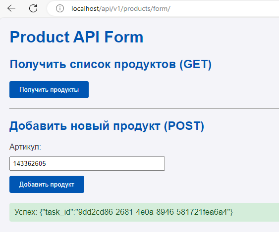
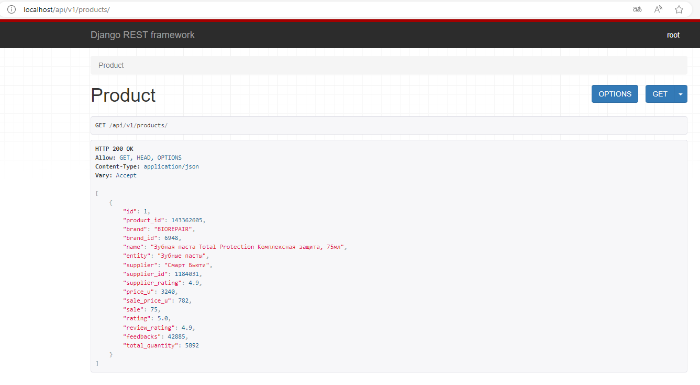

# Docker Compose

## Запуск приложения

1. **Клонирование репозитория**


   ```bash
   git clone https://github.com/rafalskypavel/WildberriesParser_DjangoDocker.git
   ```

2. **Переход в папку с проектом**


   ```bash
   cd dfrsite
   ```

3. **Запуск приложения с Docker Compose**


   ```bash
   docker-compose up
   ```

---

Переход по адресу: http://localhost/api/v1/products/form/




## Ресурсы

- **Видео**: [Docker Compose Demo](https://www.youtube.com/watch?v=0uLDObuutFs&t=1007s)
- **Исходный код**: [GitHub - docker-compose-demo](https://github.com/python-dev-blog/docker-compose-demo)

---

# Проект: Python Developer для работы на маркетплейсах

## Обязанности:
- Разработка API для сбора данных о товарах с маркетплейса Wildberries и их хранения в базе данных.
- Реализация двух эндпоинтов API с использованием Python, Django, DRF, PostgreSQL, Celery, Redis и Docker.

## Технические требования:
- Python 3.10+
- Django
- Django Rest Framework (DRF)
- PostgreSQL
- Celery
- Redis
- Docker

## Задание:

1. **API для получения информации о товаре**:
   - Эндпоинт принимает артикул товара Wildberries.
   - Запускает задачу Celery для сбора информации (остатки, склады, цена и т.д.).
   - Сохраняет эти данные в базе данных.

2. **API для вывода списка товаров**:
   - Эндпоинт выводит список товаров с информацией, полученной от первого эндпоинта.

## Дополнительные требования:
- Решение должно быть загружено в репозиторий на GitHub.
- В репозитории должен быть файл с инструкцией по установке и запуску проекта (например, README.md).
